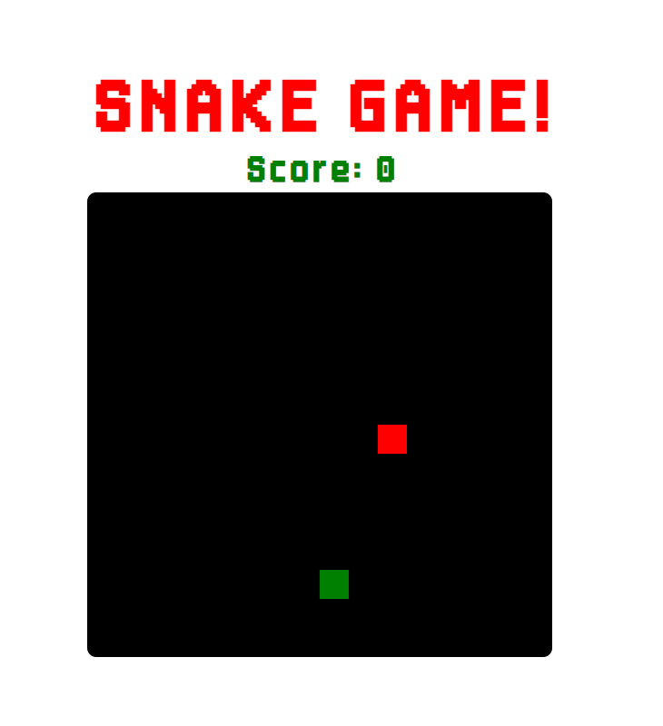
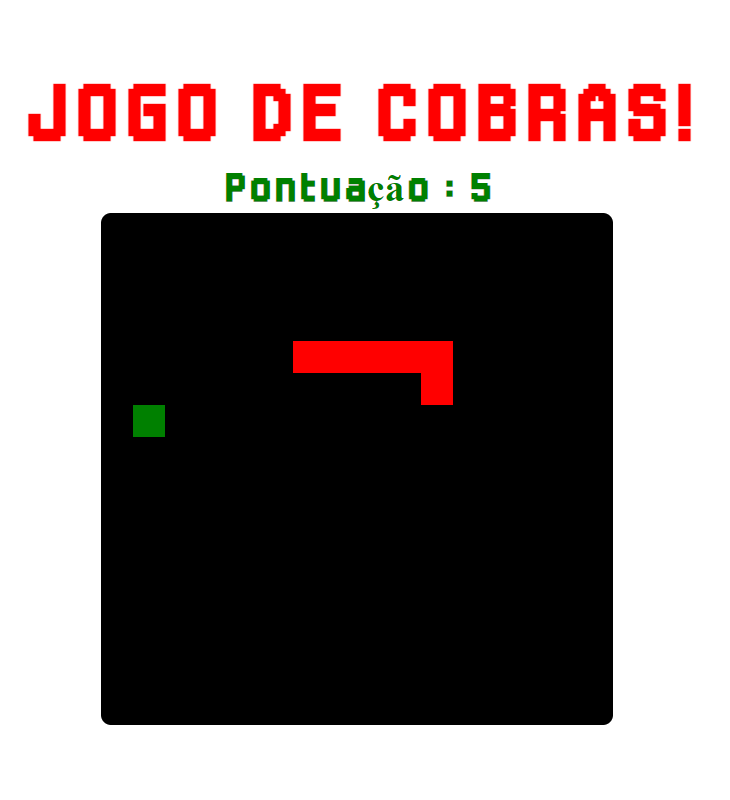
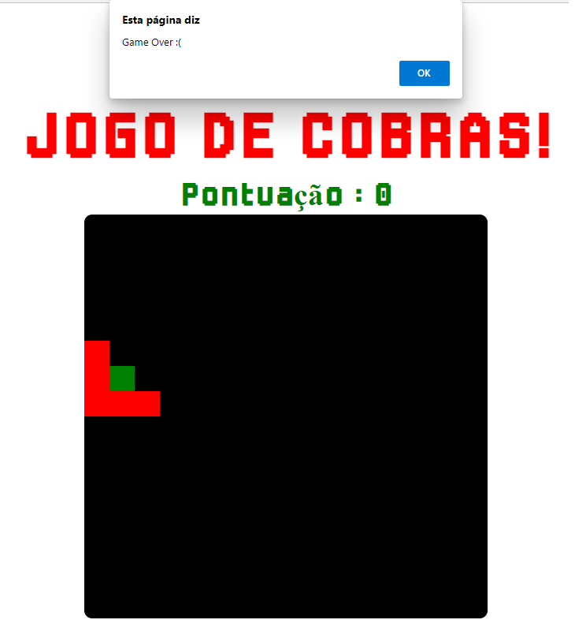

   

<!-- Title -->
<h1 align="center">DIO - Recriando o jogo da cobrinha com JavaScript</h1>

<!-- Subtitle -->
<h2 align="center"> Projeto : Snake Game </h2>

<!-- Sobre o Projeto -->

## 🚀 Sobre o Projeto
O projeto é o famoso jogo da cobrinha, desenvolvido em HTML, CSS e Javascript, o projeto original não possuia a font e nem o score que foram adicionados por mim posteriormente.

## 🖼️ Imagens do Projeto

   

   

   

## 🧰 Tecnologias e Bibliotecas

* [HTML]()
* [CSS]()
* [JavaScript]()