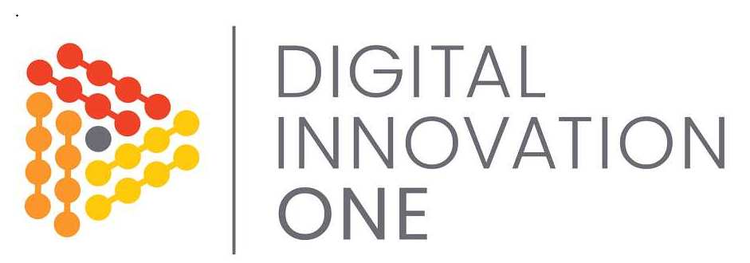

<div align="center">
   
</div>

<!-- Title -->
<h1 align="center">DIO - Recriando o jogo da cobrinha com JavaScript</h1>

<!-- Subtitle -->
<h2 align="center"> Projeto : Snake Game </h2>

<!-- Badges -->
<p align="center">
  
  
  
</p>

<!-- Sobre o Projeto -->
<a id="sobre-o-projeto"></a>
## 🚀 Sobre o Projeto
O projeto é o famoso jogo da cobrinha, desenvolvido em HTML, CSS e Javascript, o projeto original não possuia a font e nem o score que foram adicionados por mim posteriormente.

<a id="imagens-do-projeto"></a>
## 🖼️ Imagens do Projeto

<div align="center">
   
</div>

<div align="center">
   
</div>

<a id="tecnologias-e-bibliotecas"></a>
## 🧰 Tecnologias e Bibliotecas

* [HTML]()
* [CSS]()
* [JavaScript]()

<a id="rodando-o-projeto"></a>
## ⚙️ Rodando o Projeto

```bash
# Clone este repositório para a pasta anterior
$ git clone https://github.com/brunoemferreira/DIO-jogo-da-cobrinha-Javascript.git
# ou use a opção de download.

# Acesse a pasta dtmoney
$ cd DIO-jogo-da-cobrinha-Javascript

# Rodar o Projeto
$ Rode o index.html no live server do VsCode
ou
$ Abra no browser o arquivo index.html

```
---
